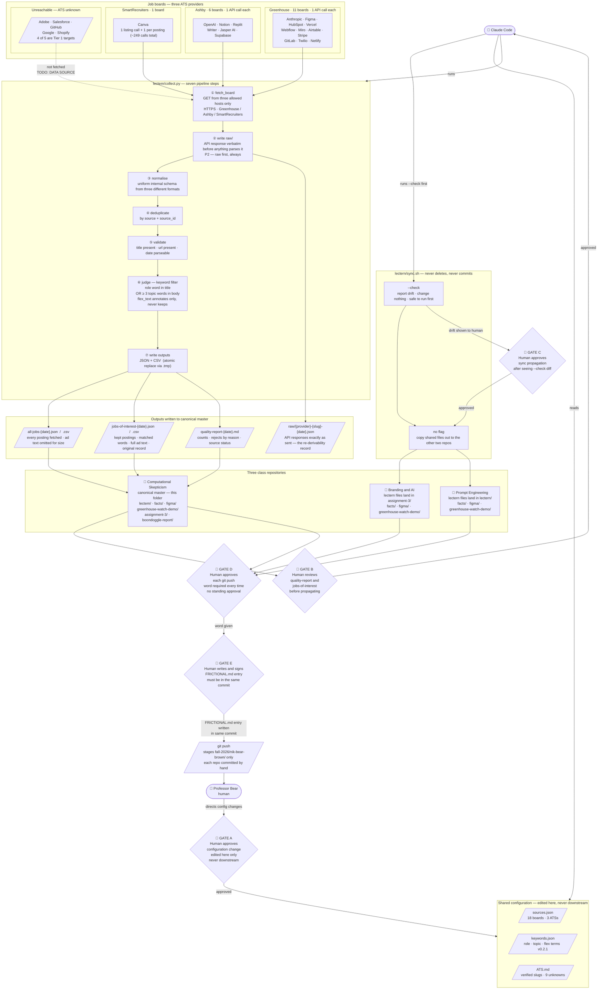

# Project diagram — Lectern job-board watcher, three-class sync

## Executive summary

The Lectern tool (`lectern/collect.py`) is a job-board watcher for teaching-related and advocacy roles in AI and education. It reads 18 boards across three applicant-tracking systems (Greenhouse, Ashby, SmartRecruiters), runs a seven-step pipeline — fetch → write raw → normalise → deduplicate → validate → keyword-filter → write outputs — and produces JSON and CSV files a human can act on. Five additional Tier 1 targets (Adobe, Salesforce, GitHub, Google, Shopify) are unreachable because their ATS is unknown; the documentation says so rather than omitting them.

The shared code and configuration are canonical in this folder (Computational Skepticism) and propagated to two other class repos — Branding and AI, and Prompt Engineering — by `lectern/sync.sh`. Sync never commits; each repo is committed and pushed by hand. Every git push to this folder requires Professor Bear's explicit approval, and the FRICTIONAL.md log must be updated in the same commit.

There are five human approval gates: (A) any change to the shared configuration, (B) reviewing outputs before propagating, (C) approving the sync after seeing the drift check, (D) approving each git push, and (E) writing and signing the FRICTIONAL.md entry. Claude Code runs every command; the human decides when and whether.

---

## FigJam

[Lectern — agentic diagram (fall 2026)](https://www.figma.com/board/xFbHv4o4SrmA0BekS5Sw1Q)
